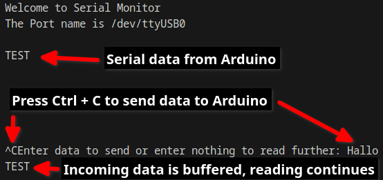

# Simple Serial Monitor & API

I built a serial monitor with writing & reading functionality. It can be used for connecting to Arduino, ESP, ...

## There is a...

### 1) Command Line Interface (CLI)

    - Start with e.g. `$ python serialmonitor.py --port /dev/ttyUSB0 --baud 9600`
    - Reading starts automatically
    - If you want to write to device you have to press Ctrl + C 
    - If you want to exit: Press Ctrl + C two times

    

### 2) Application Programming Interface (API)

    ```python
    from src import uart_api

    # Instanciates a class for the connection to device and stores incoming buffer
    api = uart_api.UART_API(port, baudrate) 

    # returns readings in String Format
    api.read()

    # writes String data to device
    api.write(data)

    # closes the port immediately
    api.close()
    ```

Thanks to [pySerial](https://github.com/pyserial)